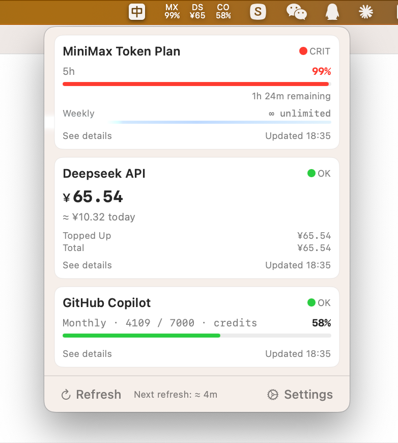

# APIUsageStatus

> **Languages:** English | [简体中文](README_zh-CN.md)

A pure menu bar macOS app designed for macOS 13 that monitors MiniMax / DeepSeek API usage and balance in real time.
**Since mainstream similar apps don't support macOS 13, this project is only a self-use scaffold project.**

## Features

- **Menu Bar Icon** — rendered in SF Pro 8pt, two-line stacked layout, one slot per enabled instance (unbounded), each sized by content width
- **Usage Panel** — click the icon to pop up a floating window showing usage cards, error summary, manual refresh, and a settings entry
- **Multi-Metric Tracking** — MiniMax tracks usage for each capability bucket (`general`, `video`, `speech-hd`, etc.) independently, each with its own 5h + weekly dual-window metrics
- **Weekly Quota Display** — MiniMax instance card shows a weekly window progress bar at the bottom; unlimited plans display a cyan-blue flowing glow bar animation
- **Threshold Alerts** — quota percentages or balance amounts trigger macOS system notifications; click the notification to view details
- **Deep-Link to Web Dashboard** — each card exposes a `See details` button that opens the provider's web usage page in the default browser (DeepSeek, MiniMax, GitHub Copilot → static URLs; OpenCode → `https://opencode.ai/workspace/<id>/go`, where `<id>` is recovered from `~/.local/share/opencode/log/*.log`; falls back to `https://opencode.ai/zh/go` if not yet recovered)
- **Balance Tracking** — records historical snapshots, displays daily averages by week / month / last 7 days / last 30 days
- **Zero External Dependencies** — only uses system frameworks like AppKit, SwiftUI, Security. OpenCode Go provider requires the `opencode` CLI to be installed locally.



### Supported Providers

| Provider | Monitoring Dimension | Data Source |
|----------|---------------------|--------------|
| MiniMax | Multi-metric: each `model_name` (capability bucket, e.g. `general`/`video`/`speech-hd`) tracks 5h + weekly independently | `www.minimaxi.com/v1/token_plan/remains` |
| DeepSeek | Topped-up amount, gifted amount, total balance, currency unit | `api.deepseek.com/user/balance` |
| GitHub Copilot | Monthly `premium_interactions` remaining percentage (Free / Pro / Pro+ / Business / Enterprise) | `api.github.com/copilot_internal/user` |
| OpenCode Go | Dollar usage of the 5h / weekly / monthly windows ($12 / $30 / $60 limits) | Local SQLite via `opencode db` CLI |

### Authentication

Each provider has a different authentication model. All credentials are stored in macOS Keychain (InternetPassword type) and never written to disk in plain text.

- **MiniMax** — Paste a Token Plan Key from the MiniMax developer console. It is independent from your per-request API key.
- **DeepSeek** — Paste the API Key from your DeepSeek open platform account.
- **GitHub Copilot** — Paste a **GitHub Personal Access Token (PAT)**. Unlike the other two, Copilot does not issue its own API key; it is accessed via your GitHub identity.

  Generate a PAT with these steps:
  1. Open https://github.com/settings/tokens
  2. Click **Generate new token** → **Generate new token (classic)**. Fine-grained PATs do **not** support the `copilot` scope.
  3. **Note**: any label, e.g. `api-usage-status-copilot`.
  4. **Expiration**: 90 days recommended (or `No expiration` if preferred).
  5. **Scopes**: check **only** `copilot` — minimum-privilege principle.
  6. Click **Generate token**, then **copy it immediately** (GitHub shows it only once).
  7. Paste it into Settings → Add Instance → Provider `GitHub Copilot` → API Key field.

  Caveats:
  - The GitHub account owning the token must have an active Copilot subscription (Free / Pro / Pro+ / Business / Enterprise all work).
  - You can revoke the token at any time at https://github.com/settings/tokens.

- **OpenCode Go** — No API key required. The supplier shells out to the local `opencode` CLI (must be installed at `~/.opencode/bin/opencode`, `/usr/local/bin/opencode`, or `/opt/homebrew/bin/opencode`) and reads the usage data directly from the OpenCode SQLite database (`~/.local/share/opencode/opencode.db`). See `docs/provider-interfaces/opencode_go.md` for the data layer and `docs/provider-interfaces/opencode_workspace_resolver.md` for how the workspace ID powering the "See details" deep link is recovered.

## System Requirements

| Item | Requirement |
|------|-------------|
| macOS | ≥ 13.0 (Ventura) |
| Xcode | ≥ 14.3 (Swift 5.9) |
| Optional | [XcodeGen](https://github.com/yonaskolb/XcodeGen) (for regenerating .xcodeproj) |

## Build & Run

### 1. Generate Xcode Project (if needed)

```bash
brew install xcodegen
xcodegen generate
```

### 2. Command Line Build

```bash
# Debug build
xcodebuild -project APIUsageStatus.xcodeproj \
  -scheme APIUsageStatus \
  -configuration Debug \
  build

# Release build (ad-hoc signed)
xcodebuild -project APIUsageStatus.xcodeproj \
  -scheme APIUsageStatus \
  -configuration Release \
  build
```

### 3. Run in Xcode

```bash
open APIUsageStatus.xcodeproj
```

Then press Cmd+R to run. After the app launches, an animated "AI" icon will appear in the menu bar (cycling %/%%/%%%, no Dock icon), which transitions to data slots once you add your first instance.

### 4. First-time Setup

1. Click the menu bar icon → **Settings**
2. Click **+** (or **Add Your First Instance** on first run) to add an instance
3. Select the provider — for MiniMax, choose which models to track and their windows (5h / weekly); for other providers, metrics are pre-configured
4. Enter a display name and a 2-3 character short name (for the menu bar), then paste your API Key (stored in Keychain)
5. Configure alert thresholds
6. The menu bar icon will automatically refresh to reflect usage status

## Running Tests

```bash
xcodebuild -project APIUsageStatus.xcodeproj \
  -scheme APIUsageStatus \
  -configuration Debug \
  test
```

Or press Cmd+U in Xcode.

### Test Suites (159 cases in total, excluding deprecated)

| Suite | Count | Coverage |
|-------|-------|----------|
| BalanceCalculatorTests | 14 | Consumption calculation, cross-day archiving, top-up detection, daily average statistics, history trimming |
| MiniMaxResponseParserTests | 11 | Normal parsing, auth errors, business errors, malformed JSON, multiple models, weekly fields |
| DeepSeekResponseParserTests | 8 | CNY priority parsing, fallback, `is_available=false`, empty array |
| CopilotResponseParserTests | 12 | GitHub Copilot API response parsing, token scopes, error responses |
| RetryPolicyTests | 6 | Retry behavior, backoff delay, max attempts |
| WeeklyQuotaTests | 10 | Weekly field parsing, `isUnlimited` judgment, missing field fallback |
| FlowingGlowBarTests | 5 | Glow bar phase, width, geometry constraints |
| MenuBarIconRendererTests | 15 | Property-assertion + snapshot: breathing state tracking, shadow, animation lifecycle, monochrome, multi-slot |
| OpenCodeResponseParserTests | 11 | Real fixture parsing, window algorithm tests, makeResponse shape |
| ShellProcessRunnerTests | 4 | Success, executable-not-found, non-zero exit, timeout |
| BreathingMathTests | 17 | Breathing animation phase, shadow radius, shadow opacity, config validation |
| InstanceCardViewTests | 12 | Rendering (display name, subtitle, shortName badge, toggle, buttons), edit/delete callbacks, provider display mapping |
| SettingsViewModelTests | 12 | Sidebar navigation (Services/General/About), form bindings (refresh interval, color mode, launch at login, notifications) |
| ProviderPickerAndThresholdTests | 13 | Provider picker UI, MiniMax model selection, threshold validation (quota + balance) |
| StatusDotViewTests | 2 | Pixel-level color resolution for trackingOn/trackingOff via snapshot |
| EmptyStateGuideViewTests | 4 | Empty state rendering (icon, text, CTA button), button action callback |
| ProviderIconTests | 3 | SF Symbol name mapping for all 4 providers |
| ~~PixelFontEngineTests~~ | ~~58~~ | ~~(Deprecated) Original pixel font engine tests; code is commented out and does not run~~ |

## Deploy to /Applications

```bash
# Copy the Release bundle
cp -R build/Release/APIUsageStatus.app /Applications/

# First launch needs to bypass Gatekeeper (right-click → Open), or run:
xattr -cr /Applications/APIUsageStatus.app
```

> Note: `xattr -cr` is only needed for `.app` bundles obtained from outside this build — e.g., downloaded from the web, copied from an external drive, or extracted from a release archive. Locally built `.app` files do not carry the quarantine attribute and do not need this step.

Then enable "Launch at Login" in the app's Settings.

## Project Structure

```
APIUsageStatus/
├── APIUsageStatusApp.swift        # @main entry + NSApplicationDelegate
├── MenuBar/                       # Menu bar icon and usage panel controllers
├── Views/                         # SwiftUI views (panel/card/settings/details)
├── AppState/                      # Runtime state Actor + @MainActor proxy
├── Models/                        # Data models (instance/balance/threshold/global settings, BreathingMath)
├── Services/                      # Core services (Keychain/persistence/refresh/notification/launch at login)
├── Shell/                         # Shell process execution (used by OpenCode Go supplier)
├── Network/                       # HTTP client + retry policy
├── Suppliers/                     # Provider protocol + MiniMax / DeepSeek / Copilot / OpenCode implementations
├── Balance/                       # Balance calculator + history snapshots
├── PixelFont/                     # ⚠️ Deprecated: original pixel font engine (code commented out)
├── Extensions/                    # Date/Decimal/String extensions
├── Utilities/                     # Logging + atomic writes + CVDisplayLinkRunner (breathing animation driver)
├── Resources/                     # Info.plist + AppIcon source files
└── Assets.xcassets/               # Compiled AppIcon asset catalog
APIUsageStatusTests/
├── BalanceCalculatorTests.swift
├── MiniMaxResponseParserTests.swift
├── DeepSeekResponseParserTests.swift
├── CopilotResponseParserTests.swift
├── RetryPolicyTests.swift
├── WeeklyQuotaTests.swift
├── FlowingGlowBarTests.swift
├── MenuBarIconRendererTests.swift
├── OpenCodeResponseParserTests.swift
├── ShellProcessRunnerTests.swift
├── BreathingMathTests.swift
├── ~~PixelFontEngineTests.swift~~  # Deprecated (code commented out)
└── ReferenceImages/               # Snapshot test golden images
```

## Security & Privacy

- **⚠️ App Sandbox** — **Disabled** so that the OpenCode Go supplier can run `opencode db` via `Process.run()` to read the local SQLite database. This is the only way to query OpenCode Go usage (there is no public REST API). The trade-off:
  - **What's gained**: OpenCode Go real-time usage monitoring (5h / weekly / monthly windows) directly from local data — no need to wait for an official API.
  - **What's lost**: macOS App Sandbox protections. The app can now theoretically access any file the current user can access, and spawn child processes. In practice, this project is self-compiled and self-used — it only talks to known HTTPS API endpoints and spawns only the `opencode` CLI; it never processes untrusted user input. The actual attack surface increase is negligible for personal use. See `docs/provider-interfaces/opencode_go.md` for details.
  - **If you don't use OpenCode Go**: the only code path that requires sandbox-disabled is `ShellProcessRunner` (invoked solely by `OpenCodeSupplier`). The MiniMax / DeepSeek / Copilot suppliers work identically with or without sandbox.
- **API Key** — stored in Keychain (InternetPassword type), never written to disk in plain text
- **Network** — only HTTPS access to provider APIs, no user data transmitted
- **Logging** — os.Logger, sensitive information automatically masked in production