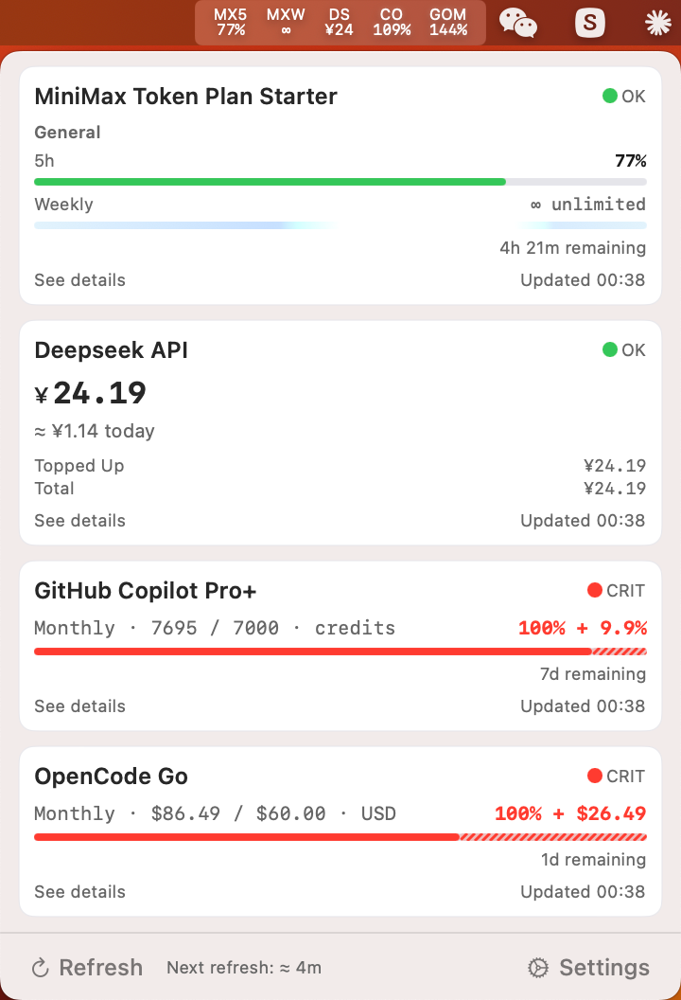
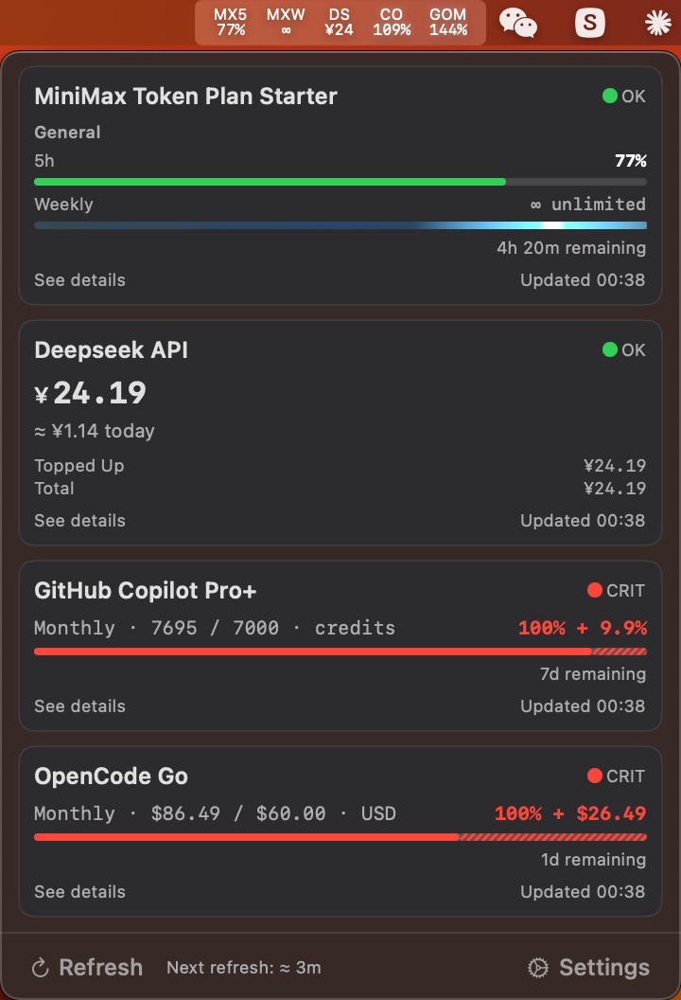

# APIUsageStatus

> **语言：** [English](README.md) | 简体中文

一个专为 macOS 13 设计的纯菜单栏 macOS 应用，实时监控 MiniMax / DeepSeek / GitHub Copilot / OpenCode Go 的 API 用量与余额。
**因主流同类应用不再兼容 macOS 13，故本项目仅为自用脚手架项目。**

## 功能概览

- **菜单栏图标** — SF Pro 8pt 渲染，2 行堆叠布局，每个启用的 metric 占一个槽位（MiniMax 实例按选中的窗口展开成多个槽位，其他供应商各 1 个槽位），数量无上限，宽度由内容决定
- **用量面板** — 点击图标弹出浮动窗口，展示用量卡片、错误汇总、手动刷新和设置入口
- **多指标追踪** — MiniMax 按 `model_name`（能力桶，如 `general`、`video`、`speech-hd` 等）独立追踪用量，每个桶都有自己的 5h + weekly 双窗口指标
- **周配额展示** — MiniMax 实例卡片底部展示周窗口进度条；无限额计划用青蓝辉光条动画呈现
- **阈值告警** — 配额百分比或余额金额触发 macOS 系统通知，点击通知查看详情
- **Web 控制台深链** — 每张卡片底部「See details」按钮一键在默认浏览器打开对应供应商的用量详情页（DeepSeek / MiniMax / GitHub Copilot 用静态 URL；OpenCode 解析本地日志得到 workspace ID 后跳转到 `https://opencode.ai/workspace/<id>/go`，未拿到时兜底到 `https://opencode.ai/zh/go`）
- **余额追踪** — 记录历史快照，按周/月/近7天/近30天展示日均消耗
- **零外部依赖** — 仅使用 AppKit、SwiftUI、Security 等系统框架。OpenCode Go 供应商需本地安装 `opencode` CLI。

|  |  |
|---|---|

### 支持的供应商

| 供应商 | 监控维度 | 数据来源 |
|--------|---------|---------|
| MiniMax | 每个 `model_name`（如 `general` 文本、`video` 非文本）的 5h 窗口与周窗口剩余百分比 | `www.minimaxi.com/v1/token_plan/remains` |
| DeepSeek | 充值金额、赠送金额、总余额、货币单位 | `api.deepseek.com/user/balance` |
| GitHub Copilot | 月度 `premium_interactions` 剩余百分比（Free / Pro / Pro+ / Business / Enterprise 全覆盖） | `api.github.com/copilot_internal/user` |
| OpenCode Go | 5h / 每周 / 每月窗口的美元用量（上限 $12 / $30 / $60） | 本地 SQLite，通过 `opencode db` CLI 读取 |

### 凭据配置

各供应商的认证方式不同。所有凭证均存储在 macOS Keychain（InternetPassword 类型），不会以明文落盘。

- **MiniMax** — 粘贴 MiniMax 开发者控制台签发的 Token Plan Key。该 Key 与按量计费 API Key 相互独立。
- **DeepSeek** — 粘贴 DeepSeek 开放平台账户的 API Key。
- **GitHub Copilot** — 粘贴 **GitHub Personal Access Token (PAT)**。与前两者不同，Copilot 自身不签发 API Key，而是通过你的 GitHub 身份访问。

  PAT 生成步骤：
  1. 打开 https://github.com/settings/tokens
  2. 点击 **Generate new token** → **Generate new token (classic)**（注意：Fine-grained PAT 不支持 `copilot` scope）
  3. **Note**：任意备注，如 `api-usage-status-copilot`
  4. **Expiration**：建议 90 天（或按需 `No expiration`）
  5. **Scopes**：**只勾** `copilot` —— 最小权限原则
  6. 点击 **Generate token**，**立即复制**（GitHub 仅展示一次）
  7. 粘贴到本应用 Settings → Add Instance → Provider `GitHub Copilot` → API Key 框

  注意事项：
  - Token 对应的 GitHub 账号必须已开通 Copilot 订阅（Free / Pro / Pro+ / Business / Enterprise 均可）
  - 可随时在 https://github.com/settings/tokens 撤销

- **OpenCode Go** — 无需 API Key。供应商通过 shell 调用本地 `opencode` CLI（需安装在 `~/.opencode/bin/opencode`、`/usr/local/bin/opencode` 或 `/opt/homebrew/bin/opencode`），直接读取 OpenCode SQLite 数据库（`~/.local/share/opencode/opencode.db`）中的用量数据。数据层详见 `docs/provider-interfaces/opencode_go.md`；为「See details」深链提供 workspace ID 的离线恢复机制详见 `docs/provider-interfaces/opencode_workspace_resolver.md`。

## 系统要求

| 项目 | 要求 |
|------|------|
| macOS | ≥ 13.0（Ventura） |
| Xcode | ≥ 14.3（Swift 5.9） |
| 可选 | [XcodeGen](https://github.com/yonaskolb/XcodeGen)（用于重新生成 .xcodeproj） |

## 构建与运行

### 1. 生成 Xcode 项目（如需要）

```bash
brew install xcodegen
xcodegen generate
```

### 2. 命令行构建

> 若 `xcodebuild` 报错 `tool 'xcodebuild' requires Xcode`，需在命令前加 `DEVELOPER_DIR=/Applications/Xcode.app/Contents/Developer`，或执行 `sudo xcode-select -s /Applications/Xcode.app` 切换工具链。

```bash
# Debug 构建
xcodebuild -project APIUsageStatus.xcodeproj \
  -scheme APIUsageStatus \
  -configuration Debug \
  build

# Release 构建（ad-hoc 签名）
xcodebuild -project APIUsageStatus.xcodeproj \
  -scheme APIUsageStatus \
  -configuration Release \
  build
```

### 3. Xcode 中运行

```bash
open APIUsageStatus.xcodeproj
```

然后 Cmd+R 运行。应用启动后会在菜单栏显示动画 `AI` 图标（底行循环 `%`/`%%`/`%%%`，无 Dock 图标），添加第一个实例后自动切换为数据槽位。

### 4. 首次配置

1. 点击菜单栏图标 → **Settings**
2. 点击 **+**（首次使用点击 **Add Your First Instance**）添加实例
3. 选择供应商 —— MiniMax 可选择要跟踪的模型及窗口（5h / 每周）；其他供应商自动配置默认指标
4. 输入显示名和 2-3 个字符的简称（用于菜单栏），粘贴 API Key（保存在 Keychain 中）
5. 配置告警阈值
6. 菜单栏图标将自动刷新为用量状态

## 运行测试

```bash
xcodebuild -project APIUsageStatus.xcodeproj \
  -scheme APIUsageStatus \
  -configuration Debug \
  test
```

或在 Xcode 中按 Cmd+U。

测试目标覆盖各供应商响应解析（MiniMax / DeepSeek / Copilot / OpenCode）、刷新与持久化服务、余额计算、菜单栏渲染、SwiftUI 视图，以及基于快照的像素级校验。原 `PixelFontEngineTests`（58 个用例）保留在 `#if false` 内仅供历史参考，不参与运行。

## 部署到 /Applications

```bash
# 复制 Release 包
cp -R build/Release/APIUsageStatus.app /Applications/

# 首次运行需绕过 Gatekeeper（右键 → 打开），或执行：
xattr -cr /Applications/APIUsageStatus.app
```

> 注意：`xattr -cr` 仅适用于从外部获取的 `.app` 包（例如从网络下载、从外接硬盘拷贝、或从 release 压缩包解压）。本地编译产物的 `.app` 不会带隔离标记，无需此命令。

然后在应用的 Settings 中启用「开机自启」即可。

## 项目结构

```
APIUsageStatus/
├── APIUsageStatusApp.swift        # @main 入口 + NSApplicationDelegate
├── MenuBar/                       # 菜单栏图标与用量面板控制器
├── Views/                         # SwiftUI 视图（面板/卡片/设置/详情）
├── AppState/                      # 运行时状态 Actor + @MainActor 代理
├── Models/                        # 数据模型（实例/余额/阈值/全局设置、BreathingMath）
├── Services/                      # 核心服务（Keychain/持久化/刷新/通知/开机自启）
├── Shell/                         # Shell 进程执行（OpenCode Go 供应商使用）
├── Network/                       # HTTP 客户端 + 重试策略
├── Suppliers/                     # 供应商协议 + MiniMax / DeepSeek / Copilot / OpenCode 实现
├── Balance/                       # 余额计算器 + 历史快照
├── PixelFont/                     # ⚠️ 已弃用：原像素字体引擎（代码已注释）
├── Extensions/                    # Date/Decimal/String 扩展
├── Utilities/                     # 日志 + 原子写入
├── Resources/                     # Info.plist + AppIcon 源文件
└── Assets.xcassets/               # 编译期 AppIcon 图标集
APIUsageStatusTests/                # 单测 + 快照测试，覆盖各供应商解析、
                                    # 刷新与持久化服务、余额计算、菜单栏
                                    # 渲染、SwiftUI 视图等。
                                    # ReferenceImages/ 存放快照金标准。
                                    # PixelFontEngineTests.swift 已用
                                    # `#if false` 关闭（已弃用）。
```

## 安全与隐私

- **⚠️ App Sandbox** — **已关闭**，以便 OpenCode Go 供应商能通过 `Process.run()` 执行 `opencode db` 命令读取本地 SQLite 数据库。这是查询 OpenCode Go 用量的唯一途径（无公开 REST API）。权衡说明：
  - **获得**：OpenCode Go 实时用量监控（5h / 每周 / 每月窗口），直接从本地数据读取，无需等待官方 API。
  - **失去**：macOS App Sandbox 保护。应用理论上可以访问当前用户可访问的任何文件，以及启动子进程。但本项目为自编译自用——仅与已知的 HTTPS API 端点通信，仅启动 `opencode` CLI，不处理不可信用户输入。在个人使用场景下，实际攻击面增加可忽略不计。详见 `docs/provider-interfaces/opencode_go.md`。
  - **若不使用 OpenCode Go**：唯一需要关闭沙箱的代码路径是 `ShellProcessRunner`（仅由 `OpenCodeSupplier` 调用）。MiniMax / DeepSeek / Copilot 供应商在开启或关闭沙箱下行为完全一致。
- **API Key** — 存储在 Keychain（InternetPassword 类型），不落磁盘明文
- **网络** — 仅 HTTPS 访问供应商 API，不传输任何用户数据
- **日志** — os.Logger，生产环境自动屏蔽敏感信息
